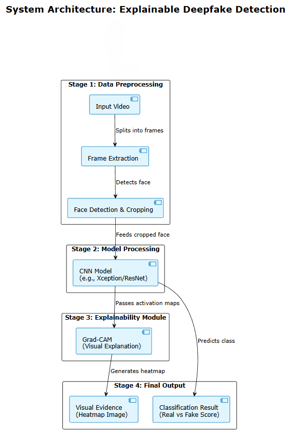
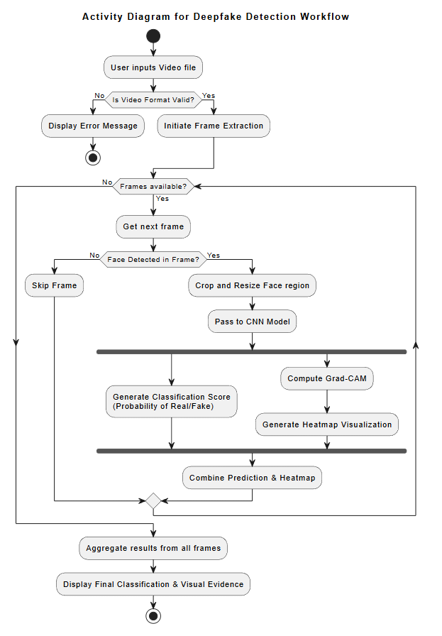
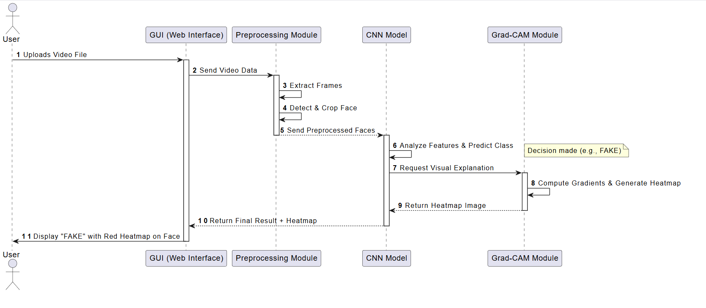
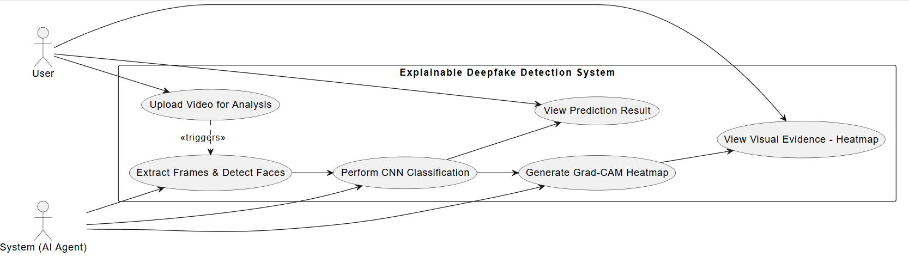

# 🔍 Explainable Deepfake Detection using Frame-Level Analysis & Grad-CAM


## 📌 Project Overview
This repository contains the core Artificial Intelligence and Data Science backend for an Explainable Deepfake Detection System. Instead of just providing a binary "Real" or "Fake" classification, this project focuses on **Explainable AI (XAI)** by utilizing **Grad-CAM (Gradient-weighted Class Activation Mapping)**. 

The system breaks down videos into frames, detects faces, runs them through a Convolutional Neural Network (CNN), and generates visual heatmaps to explicitly show *why* a specific face was classified as fake.

*Note: This repository contains the 6 core backend AI modules (without the UI layer).*

---

## 🏗️ System Architecture

The pipeline is divided into 4 main stages, executed across 6 standalone modules:
1. **Data Preprocessing:** Video input is split into individual frames.
2. **Face Detection & Cropping:** Faces are isolated from the extracted frames.
3. **Model Processing:** Cropped faces are fed into the CNN model (e.g., Xception/ResNet) for feature analysis.
4. **Explainability Module (Grad-CAM):** Generates heatmaps highlighting manipulated regions.

### Architecture Diagram
*(See the logical flow of the system below)*


---

## ⚙️ Core Modules (The 6-Step Pipeline)

Our backend system strictly follows a 6-module architecture:

1. `01_frame_extraction.py` - Extracts raw frames from the input video.
2. `02_face_detection.py` - Detects and crops faces from the frames using MTCNN/OpenCV.
3. `03_data_preprocessing.py` - Normalizes and prepares face images for the model.
4. `04_model_training.py` - Handles the CNN model training and weight optimization.
5. `05_evaluation.py` - Evaluates model performance (Accuracy, Loss, F1-Score).
6. `06_gradcam_prediction.py` - Computes gradients and overlays the heatmap on the face image for final visual evidence.

---

## 📊 Workflow Diagrams

To understand the system's data flow and user interaction, refer to the diagrams below:

### 1. Activity Diagram
Shows the step-by-step frame processing loop, from video input to final heatmap generation.


### 2. Sequence Diagram
Illustrates the chronological interaction between the components.


### 3. Use Case Diagram
Maps out the system functionalities triggered by user actions.


---

## 🚀 Installation & Setup

1. **Clone the repository:**
   ```bash
   git clone [https://github.com/senthamilvalavan/Explainable_Deepfake_Detection.git](https://github.com/senthamilvalavan/Explainable_Deepfake_Detection.git)
   cd Explainable_Deepfake_Detection
